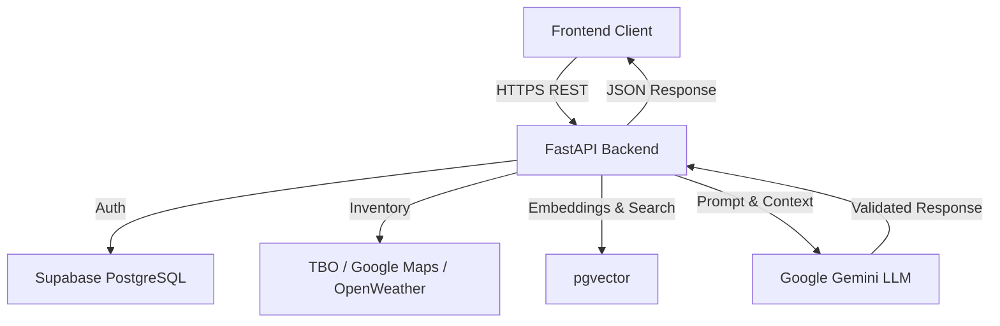

# Architecture Overview

TRAVELVERSE AI is a robust, full-stack travel platform combining a modern React frontend with a high-performance FastAPI backend. It leverages Supabase PostgreSQL for persistence and Google's Gemini for state-of-the-art AI orchestration.

## Core Components

1. **Frontend (React / TypeScript)**
   - Responsible for rendering the user interface, Agent Copilot, and Traveler UI.
   - Strictly consumes the backend FastAPI endpoints via `src/lib/api/ai.ts`.
   - Never accesses third-party APIs or Gemini directly.

2. **Backend (FastAPI / Python)**
   - The central nervous system of the platform.
   - Exposes RESTful endpoints for the frontend.
   - Handles Authentication, Authorization, and Session Management.
   - Orchestrates AI tools, RAG, and Inventory lookups.

3. **Database (Supabase PostgreSQL)**
   - Stores Users, Trips, Bookings, Conversations, AI Memory, and Knowledge Chunks.
   - Utilizes `pgvector` for high-performance semantic search on RAG documents.

4. **AI Layer (Gemini)**
   - The core intelligence engine routing user intents (`IntentEngine`).
   - Retrieves grounded context (`RAGService`).
   - Parses tools and synthesizes responses (`TravelAIOrchestrator`).

## Data Flow

